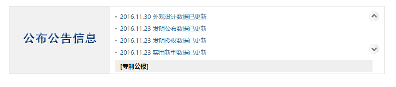

#  [中国专利公布公告](http://epub.sipo.gov.cn/index.action)

@(找茬)[优化|帮助|Markdown]

**中国专利公布公告**可按照发明公布、发明授权、实用新型和外观设计四种公布公告数据查询1985年9月10日至今的专利信息。
 
- **检索功能** ：可以按照发明公布、发明授权、实用新型和外观设计四种公布公告数据进行查询。；
- **数据范围** ：中国专利公布公告信息，以及实质审查生效、专利权终止、专利权转移、著录事项变更等事务数据信息；
- **更　　新** ：每周三。

-------------------

[TOC]

## 搜索输入框

>可输入专利关键词、选择专利类型，进行搜索

### 源代码
``` html
<div class="soso_box">
	<dl>
		<dt>公布公告查询
			<input onkeypress="javascript:if(event.keyCode == 13) patqs()" class="inputin" style="width:380px" type="text" id="soso_text" value="" />
			<input onclick="patqs()" class="sobtn" id="soso" type="image" src="images/soso_ann.png" />
		</dt>
		<dd>
			<span><input name="lx" type="checkbox" value="ip" />发明公布</span>
			<span><input name="lx" type="checkbox" value="ig" />发明授权</span>
			<span><input name="lx" type="checkbox" value="ug" />实用新型</span>
			<span><input name="lx" type="checkbox" value="dg" />外观设计</span>
			<a href="sysm.jsp" target="_blank">使用说明</a>
		</dd>
	</dl>
</div>
```
### 原效果图

1. 源代码中对于搜索输入框、发明类型复选按钮的包裹使用了&lt;dl>、&lt;dt>、&lt;dd>标签，这些标签一般是用来进行定义，或者如第二部分公布公告信息那样使用。&lt;dl> 标签定义用于定义列表（definition list），常结合&lt;dt> 来定义列表中的项目，结合&lt;dd> 描述列表中的项目。
此处是表单元素，可模仿百度、360等搜索页面，使用&lt;form>标签进行包裹。
2. 对于专利类型复选按钮，源代码将其放在&lt;span>标签中，&lt;span>是行内元素，不提供特殊的样式和效果。
可四个复选按钮放在&lt;label>标签内，当点击四个专利类型描述文字时，相应的复选按钮即可获得焦点。
### 代码优化
``` html
<div class="soso_box">
	<form method="POST">
		<div class="soso-text">
			<label for="soso_text">公布公告查询<label>
			<input onkeypress="javascript:if(event.keyCode == 13) patqs()" class="inputin" style="width:380px" type="text" id="soso_text" value="" />
			<input onclick="patqs()" class="sobtn" id="soso" type="image" src="images/soso_ann.png" />
		</div>
		<div class="soso-checkbox">
			<label><input name="lx" type="checkbox" value="ip" />发明公布</label>
			<label><input name="lx" type="checkbox" value="ig" />发明授权</label>
			<label><input name="lx" type="checkbox" value="ug" />实用新型</label>
			<label><input name="lx" type="checkbox" value="dg" />外观设计</label>
			<a href="sysm.jsp" target="_blank">使用说明</a>
		</div>
	</form>
</div>
```

## 公布公告信息

>关于各类专利公布公告的近期和历史数据

### 源代码
``` html
<dl class="in_ggbox">
	<dt></dt>
	<dd id="container">
		<div class="mouse_direction">
			<div class="mouse_top"><a></a></div>
			<div class="mouse_bottom"><a></a></div>
		</div>
		<ol>
			<li><a href="javascript:zl_pp('2016.12.07','ip');">2016.12.07 发明公布数据已更新</a></li>
			<li><a href="javascript:zl_pp('2016.12.07','ig');">2016.12.07 发明授权数据已更新</a></li>
			<li><a href="javascript:zl_pp('2016.12.07','ug');">2016.12.07 实用新型数据已更新</a></li>
			<li><a href="javascript:zl_pp('2016.12.07','dg');">2016.12.07 外观设计数据已更新</a></li>
			<li><a href="javascript:zl_pp('2016.11.30','ip');">2016.11.30 发明公布数据已更新</a></li>
			<li><a href="javascript:zl_pp('2016.11.30','ig');">2016.11.30 发明授权数据已更新</a></li>
...<!--此处省略多个li标签-->
		</ol>
		<p class="in_ggbot"><a href="gbl.action">[专利公报]</a></p>
	</dd>
</dl>
```
### 原效果图

1. 源代码中将**专利公报**链接放在&lt;p>标签中，并且占据右侧一行；而此链接的作用是显示&lt;ol>列表的详细列表项，放在此处语义不明，且占据了可显示列表的空间，左侧图片与文字意义基本相同，故将此链接修改到左侧&lt;dt>标签内的图片位置，加上下划线，表明此处是链接，右侧&lt;dt>内即可设置成一次显示5条列表信息。

### 代码优化
``` html
<dl class="in_ggbox">
	<dt><a href="gbl.action">公布公告信息</a></dt>
	<dd id="container">
		<div class="mouse_direction">
			<div class="mouse_top"><a></a></div>
			<div class="mouse_bottom"><a></a></div>
		</div>
		<ol>
			<li><a href="javascript:zl_pp('2016.12.07','ip');">2016.12.07 发明公布数据已更新</a></li>
			<li><a href="javascript:zl_pp('2016.12.07','ig');">2016.12.07 发明授权数据已更新</a></li>
			<li><a href="javascript:zl_pp('2016.12.07','ug');">2016.12.07 实用新型数据已更新</a></li>
			<li><a href="javascript:zl_pp('2016.12.07','dg');">2016.12.07 外观设计数据已更新</a></li>
			<li><a href="javascript:zl_pp('2016.11.30','ip');">2016.11.30 发明公布数据已更新</a></li>
			<li><a href="javascript:zl_pp('2016.11.30','ig');">2016.11.30 发明授权数据已更新</a></li>
...<!--此处省略多个li标签-->
		</ol>
	</dd>
</dl>
```

## 反馈与建议
- 邮箱：<605690919@qq.com>

---------
感谢阅读这份帮助文档。

